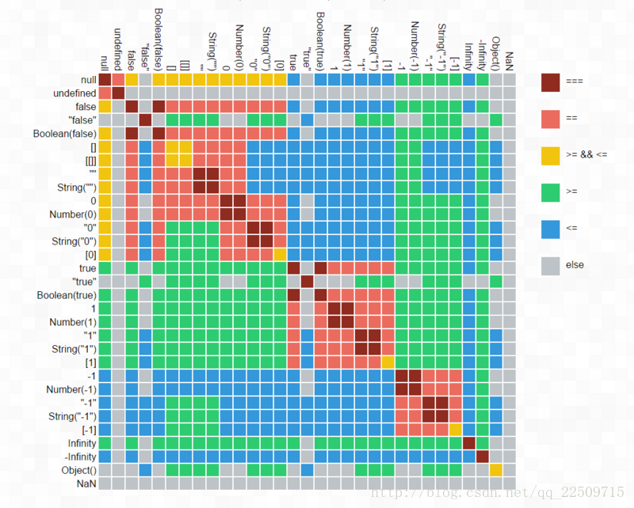

# **JavaScript基础**

- [数据类型](#数据类型)
- [DOM](#dom)

## **数据类型**

- 基本类型：Undefined、Null、Boolean、Numeber、String
- 基本类型间的比较是其值的比较：’{}‘ === '{}' //true
- 引用类型：Object、Array、Function、Date、RegExp、Error、(Map、Set和Symbo)(ES6)
- 引用类型间比较是其引用的比较:{} === {} //false

---

>JS中’===‘和’==‘区别:
>
>- == equality 等同，=== identity 恒等。
>- ==， 两边值类型不同的时候，**要先进行类型转换，再比较**。
>- ===，**不做类型转换**，**类型不同的一定不等**。
>- 先说 ====,下面的规则用来判断两个值是否===相等。
>>1. 如果类型不同，就[不相等]
>>2. 如果两个都是数值，并且是同一个值，那么[相等]；(！例外)的是，如果其中至少一个是NaN，那么[不相等]。（判断一个值是否是NaN，只能用isNaN()来判断）
>>3. 如果两个都是字符串，每个位置的字符都一样，那么[相等]；否则[不相等]。
>>4. 如果两个值都是true，或者都是false，那么[相等]。
>>5. 如果两个值都引用同一个对象或函数，那么[相等]；否则[不相等]。
>>6. 如果两个值都是null，或者都是undefined，那么[相等]。
>- 再说 ==，根据以下规则：
>>1. 如果两个值类型相同，进行 === 比较。
>>2. 如果两个值类型不同，他们可能相等。根据下面规则进行类型转换再比较：
>>3. 如果一个是null、一个是undefined，那么[相等]。
>>4. 如果一个是字符串，一个是数值，把字符串转换成数值再进行比较。
>>5. 如果任一值是 true，把它转换成 1 再比较；如果任一值是 false，把它转换成 0 再比较。
>>6. 如果一个是对象，另一个是数值或字符串，把对象转换成基础类型的值再比较。对象转换成基础类型，利用它的toString或者valueOf方法。 js核心内置类，会尝试valueOf先于toString；例外的是Date，Date利用的是toString转换。
>>7. 任何其他组合，都[不相等]。
>> 
---

- JS拥有**动态类型**，相同变量可以用作不同类型，程序允许时，变量会进行自动转换

```js
var x; //x为undefined
var x = 6; //x为数字
var x = 'Bill' //x为字符串
1 + '2' = '12'; //1转换为‘1’
if(1){} //1转换为true
```

## **DOM介绍**  <a id='dom'></a>

- [深入浅出DOM基础——《DOM探索之基础详解篇》学习笔记](https://github.com/jawil/blog/issues/9)
- 获取DOM节点
  - 获取**id属性**为test的DOM节点: //&lt;div id='test'&gt;&lt;/div&gt;
    ```js
    document.getElementById('test');
    ```
  - 获取**class属性**含有test的DOM节点数组://&lt;div class='test'&gt;&lt;/div&gt;
    ```js
    document.getElementByClassName('test');
  - 获取**name属性**为test的DOM节点数组：//&lt;input name='test'&gt;
    ```js
    document.getElementByName('test');
    ```
  - 获取**标签名**为p的DOM节点数组：//&lt;p&gt;&lt;/p&gt;
    ```js
    document.getElementByTagName('p');